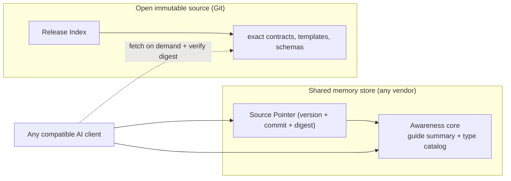
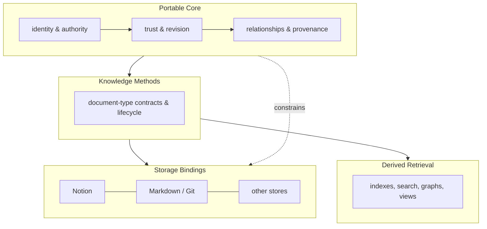

# Architecture

## Product Direction

Mind Palace is a shared knowledge operating guide for people and AI clients. AI
clients are first-class operators. Human visual navigation is useful, but it is
secondary to accurate, current, and queryable knowledge.

The protocol defines document types and collaboration rules. It does not keep a
global list of a user's individual documents. Clients find those documents from
their portable metadata, relationships, logical locations, and storage search.

## Why This Product And Shape

People who use AI agents for sustained product and engineering work need a
durable way to teach multiple agents how their knowledge should be structured
and evolved, without re-explaining a documentation process in every project or
conversation. A client should be able to start from a stable configuration
path, resolve the active guide, identify the applicable methodology, create or
update the right documents in the expected portable format, and validate or
migrate them - all without bespoke per-project onboarding instructions.

The protocol is therefore not a knowledge database and not one universal
document template. It is a portable guide and configuration layer:

- **Portable Core**: stable identity, authority, trust, revision,
  relationships, provenance, compatibility, and safe update behavior.
- **Knowledge Methods**: domain-specific artifact contracts and lifecycle.
- **Storage and client bindings**: vendor mappings and host mechanics.
- **Derived retrieval**: rebuildable indexes and views, never the only copy.

The product hypothesis is that users sustain this kind of AI-assisted work and
need repeatable structure; it is being validated by using the protocol itself
on this project. If broader users need different behavior, the system grows by
adding methodologies rather than forcing one structure onto every note type.

## Distribution And Awareness

Two independent channels distribute the protocol:

- **An open, immutable source** (a public Git repository) holds the canonical
  protocol, default methodologies, schemas, templates, validators, and approved
  public extension packages. Any client can fetch and byte-verify these.
- **A shared memory store** (Notion or any note/memory vendor) holds one stable
  common-memory installation. Any client with an authorized connector can read
  it. The store is a vendor, not the vendor; the model is vendor-neutral.

Common memory materializes a small **awareness core**: one compact,
self-describing operating guide placed on the single active release record. A
client that resolves the installation becomes aware of what Mind Palace is,
which methodology and document types apply, how to read and update knowledge,
and where to fetch the byte-exact contracts it needs. Exact schemas, templates,
and document-type contracts are never copied into common memory; they are
fetched on demand from the immutable source. A provider's rate limits and a
client's finite context therefore stay bounded, and the model scales as
document types and extension packages grow.

This is the split that matters:

- **State** (common memory): one active Source Pointer plus the awareness core.
- **Capability** (immutable source): the complete, authoritative protocol and
  its exact contracts.

A client reads the pointer and awareness core from shared memory to become
aware, then fetches only the byte-exact contracts it needs from the open source
and verifies their digests.

## Vocabulary

- **Protocol**: shared collaboration, safety, identity, and portability rules.
- **Knowledge Method**: the user-facing name for a methodology package.
- **Methodology package**: a versioned set of document-type contracts.
- **Document type**: the contract for one kind of document.
- **Storage Binding**: a vendor-specific mapping of portable rules.
- **Release Index**: an immutable list of protocol resources and their digests.
- **Source Pointer**: the active immutable repository revision and Release
  Index digest recorded in common memory.
- **Awareness Core**: a compact operating guide rendered in common memory so a
  client can become aware and operate; a derived, non-authoritative projection.
- **On-Demand Resource**: a resource fetched only when a task needs it.
- **Cache**: a disposable, verified copy of an immutable resource.

## Layers

The protocol has four independently owned layers:

1. **Portable Core** defines cross-store identity, authority, trust, revision,
   relationships, provenance, compatibility, and safe update behavior.
2. **Knowledge Methods** define document types, logical locations, lifecycle,
   retrieval, write routing, templates, validation, and migration.
3. **Storage Bindings** map portable meaning to a store's hierarchy, metadata,
   search, relationships, assets, and visual presentation.
4. **Derived Retrieval** provides rebuildable full-text search, embeddings,
   graphs, caches, catalogs, and visual views without becoming write authority.

Knowledge Methods and Storage Bindings are declarative, versioned extension
packages. Built-in packages use the same contracts as custom packages. During
the initial implementation, packages may contain Markdown, YAML, JSON Schema,
templates, and static capability declarations, but no automatically executed
extension code.

## Authority Boundaries

- Protocol repository: released contracts, guides, templates, and validators.
- Mind Palace instance: approved intent, configuration, decisions, and working
  knowledge.
- Software repository: implemented source, configuration, and test evidence.
- Reports: attributable evidence snapshots, never self-approval.

Access to a protocol or extension package does not grant access to user
knowledge. A package cannot weaken the Portable Core's trust, provenance,
conflict, revision, or migration safeguards.

## Package Model

Each Knowledge Method contains a concise guide, document-type contracts, and
self-explanatory templates. A document-type contract defines:

- purpose and applicability;
- portable format and logical location;
- shared and type-specific metadata;
- protocol and methodology versions;
- ownership, authority, lifecycle, and mutability;
- required and optional headings;
- plain-language writing rules;
- related document types and retrieval rules;
- write routing, compatibility, and migration;
- portable templates and supported asset source formats.

The protocol describes types, not document instances. For example, a Project
Hub may be a document type, but the protocol never records every project hub a
user owns.

Portable Markdown with structured metadata is the default representation.
Structured maps may use Markdown, YAML, CSV, or JSON when their document-type
contract says so. Diagrams and mind maps keep a portable source format; visual
exports are derived. Durable assets use portable references and metadata.

Bindings do not fork protocol behavior. A missing native storage feature is
emulated safely, reported as a limitation, or causes refusal.

A Storage Binding owns vendor details such as Notion databases, Obsidian
folders, Confluence labels, visual hierarchy, query syntax, import, export, and
rollback limits. These details cannot change a document type's portable meaning.

## Extension Model

Custom Knowledge Methods and Storage Bindings may come from approved private or
public sources. Each package declares a namespaced ID, version, protocol
compatibility range, immutable source revision, digest, dependencies,
capabilities, and resource classes. Installation and selection are explicit.
Untrusted, incompatible, ambiguous, or incomplete packages fail safely.

Executable plugins, automatic package discovery or installation, a central
extension registry, and automatic execution of remote code are deferred.

The default protocol and built-in methodologies come from the canonical source
repository. Approved public extension packages add further methodologies,
vendor bindings, or visualization/management behavior from their own immutable
sources. Extensions are capability resolved on demand; they never expand the
awareness core in common memory. A missing or incompatible extension fails
safely and is reported, it is not silently substituted.

Client installation is a one-time, version-neutral discovery contract. The
canonical release remains immutable and runtime-neutral; a client adapter owns
only persistent discovery placement, capability probes, and adapter rollback.
The common-memory installation owns protocol release activation. An installation
receipt records whether the client could resolve the active release and operate
as expected; it is evidence, not a second copy of instructions or a release pin.

Common memory contains one stable installation root, one latest active Source
Pointer, the awareness core rendered on the active release record, only
explicitly retained non-protocol references, and links to client receipts. A
Release Index identifies remote resources by immutable revision, path, digest,
class, and cache policy. Protocol source remains in the repository; common
memory never copies exact contracts or retains superseded protocol releases.

The awareness core is a **projection, not an authority**. It is rendered from
the immutable release and stored as common-memory content so clients can read
it directly. Rendering can change formatting, so the projection is never used
for byte verification. The immutable Git release and its digests remain
authoritative; a projection that conflicts with the release yields to the
release. This is why byte-exact artifacts (schemas, templates, document-type
contracts) are kept out of common memory entirely.

Resources have four classes, chosen by an explicit criterion:

- `core`: renderable guidance needed for ordinary awareness and operation
  (General Guide, selected methodology, storage binding, manifest). These are
  the sources of the awareness-core projection.
- `on-demand`: byte-exact contracts and templates fetched and verified when a
  task needs them (schemas, document-type contracts, templates, detail
  bindings). Never rendered in common memory.
- `maintenance`: fetched only for explicit setup, update, repair, rollback, or
  migration work.
- `development`: never distributed through common memory.

A resource is `on-demand`, not `core`, whenever byte fidelity matters for its
use or its size would bloat the projection. The schema and release index
validators enforce this split mechanically.

Verified resources may use a runtime-local disposable cache. Provider-backed
common memory does not retain protocol cache records. Cache failure must not
block read or proposal work.

After a new Source Pointer is staged, verified, activated, and resolved by the
required client checks, remove the prior protocol pointer and provider-specific
protocol copies. Rollback reconstructs a selected previous pointer from an
immutable repository release rather than retaining every release in common
memory.

Client adapters remain thin discovery hooks. Every Mind Palace operation
resolves the current active release; clients do not discover or activate newer
releases automatically.

## Methodology Resolution

A client resolves which methodology applies in this order:

1. project or topic override;
2. user/instance configuration (`instance-config` maps a work mode to a method);
3. the protocol default methodology (`product-engineering` for the initial
   built-in method).

The awareness core states the default and the override order. Protocol defaults
describe how to choose and evolve frameworks; user configuration records what
this user has chosen. Selecting a methodology never migrates existing
documents; migration is a separate, approval-gated operation.

## Deployment Safety

Source publication and common-memory deployment are separate operations. Before
any common-memory write, a read-only plan must report records, bytes,
attachments, batches, provider limits, retries, cleanup writes, and rollback cost.
An over-budget plan writes nothing. Bounded writes must resume without
duplicates and must not change the active release before validation and explicit
approval.

## Versioning

Protocol and methodology releases use Semantic Versioning after declaring
their compatibility surface. During `0.y.z`, changes may be incompatible but
must still be recorded and migration impact stated.

Artifact `revision` is a monotonic logical revision, not Semantic Versioning.
A frozen baseline also records immutable source identity or a normalized
content digest.

## First Release Boundary

The first complete extensible release supports one logical Mind Palace instance,
the `product-engineering` Knowledge Method, Notion and Markdown/Git Storage
Bindings, an awareness core in common memory, on-demand byte-verified contracts,
and declarative custom methods and bindings from approved immutable sources.

Additional built-in methods, live synchronization, executable plugins, central
registries, custom indexes, review-agent orchestration, and event systems are
deferred.
